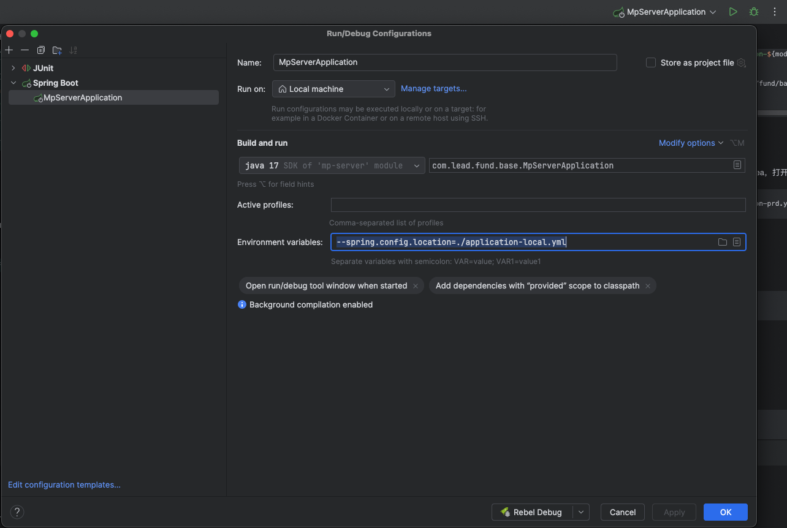

# 开发准备

## Java

<span style="color: #FF0000;">安装17+</span>，测试命令：

```text
$ java -version
openjdk version "17.0.8" 2023-07-18 LTS
OpenJDK Runtime Environment Zulu17.44+15-CA (build 17.0.8+7-LTS)
OpenJDK 64-Bit Server VM Zulu17.44+15-CA (build 17.0.8+7-LTS, mixed mode, sharing)
```

需要配置Environment variables，例如使用Idea，打开"Edit Configurations"，输入以下：

```text
--spring.config.location=./application-prd.yml
```


## Maven

<span style="color: #FF0000;">安装3.6.3+</span>，测试命令：

```text
$ mvn -v
Apache Maven 3.6.3 (cecedd343002696d0abb50b32b541b8a6ba2883f)
Maven home: /Users/panchaohui/program/apache-maven-3.6.3
Java version: 17.0.8, vendor: Azul Systems, Inc., runtime: /Users/panchaohui/.sdkman/candidates/java/17.0.8-zulu/zulu-17.jdk/Contents/Home
Default locale: en_CN, platform encoding: UTF-8
OS name: "mac os x", version: "15.3.2", arch: "aarch64", family: "mac"
```

<span style="color: #FF0000;">Copy必须依赖的包至本地仓库</span>

```shell
rm -rf ~/.m2/repository/com/lead/fund/base/
cp -rf ./resources/lib/ ~/.m2/repository/com/lead/fund/base/
```

<span style="color: #888888;">Copy必须依赖的包至项目</span>

```shell
PROJECT_VERSION=202501.1-SNAPSHOT
MANAGE_DIR="./resources/lib/manage/${PROJECT_VERSION}/"
rm -rf ${MANAGE_DIR}
mkdir -p ${MANAGE_DIR}
cp -rf ~/.m2/repository/com/lead/fund/base/manage/${PROJECT_VERSION}/ ${MANAGE_DIR}
COMMON_MODULES=("manage" "basic" "util" "log" "database" "spring" "web")
for module in "${COMMON_MODULES[@]}"; do
    dir="./resources/lib/common/common-${module}/${PROJECT_VERSION}/"
    rm -rf ${dir}
    mkdir -p ${dir}
    cp -rf ~/.m2/repository/com/lead/fund/base/common/common-${module}/${PROJECT_VERSION}/ ${dir}
done
```

## Page

前端项目在`./src/page`目录下

<span style="color: #FF0000;">安装node@18+</span>，测试命令：

```text
$ node -v
v20.18.3
$ npm -v
10.8.2
```

<span style="color: #FF0000;">参考：[readme.md](src/page/readme.md)</span>


## Mysql

<span style="color: #FF0000;">my.cnf配置</span>

```text
[mysqld]
datadir=/var/lib/mysql
socket=/var/lib/mysql/mysql.sock
symbolic-links=0
log-error=/var/log/mysqld.log
pid-file=/var/run/mysqld/mysqld.pid
bind-address=0.0.0.0
lower_case_table_names=1
max_allowed_packet=104857600
init_connect='SET NAMES utf8mb4'
character-set-server=utf8mb4
collation-server=utf8mb4_unicode_ci

[client]
default-character-set=utf8mb4

[mysql]
default-character-set=utf8mb4
```

<span style="color: #FF0000;">设置时区</span>

```shell
SET GLOBAL time_zone = '+08:00';
SET time_zone = '+08:00';
```

<span style="color: #FF0000;">执行必要脚本</span>

[database](resources/database)（包含ddl和dml）

<span style="color: #888888;">设置字符集</span>

Mysql运行时可执行

```shell
ALTER DATABASE dmmp CHARACTER SET = utf8mb4 COLLATE = utf8mb4_unicode_ci;
ALTER DATABASE douson CHARACTER SET = utf8mb4 COLLATE = utf8mb4_unicode_ci;
```

# 本地开发

## 运行Java

略

## 运行Page

<span style="color: #FF0000;">参考：[readme.md](src/page/readme.md)</span>

# 打包

```shell
mvn clean package -DskipTests
```

# 外网启动

- Terminal 1

```shell
java -Xms256m -Xmx2048m -XX:NewSize=64m -XX:MaxNewSize=64m -Dfile.encoding=utf-8 -Ddubbo.application.logger=slf4j -Djava.security.egd=file:/dev/./urandom -Dspring.profiles.active=pch -jar target/mp-server.jar --spring.config.location=./application-pch.yml
```

- Terminal 2
```shell
- cd ~/program && ./ssl
```

访问：[https://pch.mynatapp.cc/local](https://pch.mynatapp.cc/local)

# 发布

### Douson远程服务器发布Java

```shell
ssh -p 33333 root@085a8d1e51b66c57.natapp.cc << EOF
cd /opt/douson/mp-server/
./deploy java
EOF
```

### 本地打包Page并发布至Douson远程服务器

```shell
./deploy page
ssh -p 33333 root@085a8d1e51b66c57.natapp.cc << EOF
cd /opt/douson/mp-server/static && rm -rf industry && unzip industry.zip && rm -rf industry.zip
EOF
```
# 登录Douson远程服务器

```shell
ssh -p 33333 root@085a8d1e51b66c57.natapp.cc
```

# 查看定时任务

```shell
crontab -l
```